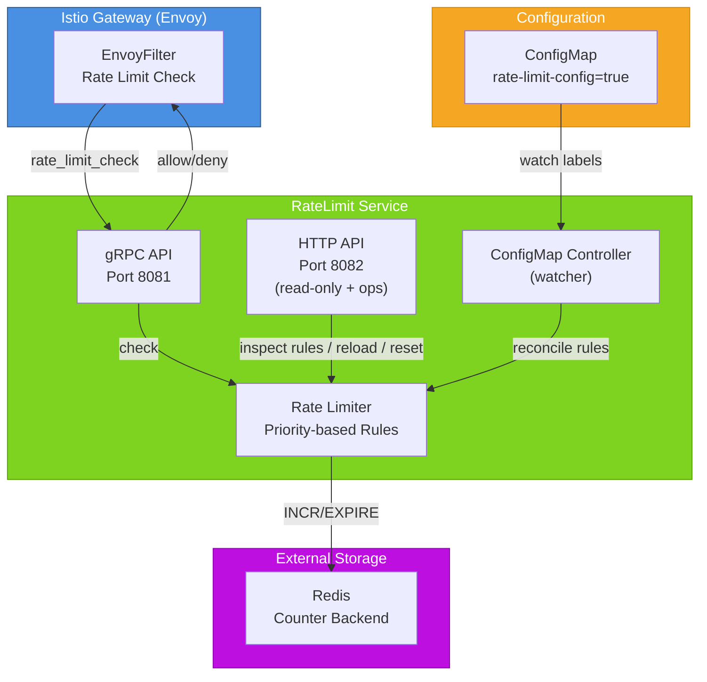

# RateLimit Service for Istio Gateway

RateLimit Service is a Kubernetes service that provides built-in rate limiting with dynamic configuration via ConfigMap and REST API.

## Features

- ✅ Built‑in rate limiter (no separate service required)
- ✅ Two algorithms: Fixed Window (fixed_window) and Sliding Log (sliding_log)
- ✅ Priority-based rule matching (highest priority rule applies first)
- ✅ Dynamic configuration via ConfigMap (auto‑reload)
- ✅ Management API for limits and statistics
- ✅ Prometheus metrics & Grafana dashboard
- ✅ Istio Gateway integration via EnvoyFilter
- ✅ Configurable key separator (e.g., `|`)
- ✅ Redis as a scalable counter backend
- ✅ User isolation with independent counters
- ✅ Rate limit reset API for individual users

## Architecture



## Installation
### Prerequisites

- Kubernetes 1.24+
- Istio 1.28+ with Gateway API enabled
- **Redis** — required. Used as the distributed counter backend; the service exits at startup if it cannot connect (see `cmd/operator/main.go`).
- Prometheus Operator — optional, only needed if you want metrics scraped via `ServiceMonitor`/`PodMonitor`. Without it the `/metrics` endpoint still works.

### Helm Install
``` bash
# Clone the repository or add Helm repo
git clone https://github.com/Netcracker/qubership-core-bootstrap.git
cd qubership-core-bootstrap/ratelimit-service

# Install the service
helm install ratelimit-service ./helm-charts \
  --namespace $NAMESPACE \
  --create-namespace \
  --set image.repository=ghcr.io/netcracker/ratelimit \
  --set image.tag=<release-tag>    # e.g. v1.0.0; use feat-ratelimit-snapshot for the latest dev build

# Verify Installation
kubectl get pods -n $NAMESPACE -l app=ratelimit-service
kubectl get envoyfilter -n $NAMESPACE
```

## Configuration
Rate limiting rules are defined in ConfigMaps with the label rate-limit-config=true.

### Configuration example
```yaml
apiVersion: v1
kind: ConfigMap
metadata:
  name: ratelimit-config
  labels:
    rate-limit-config: "true"  # Required label for auto-discovery
    app: ratelimit-service
    version: v1
data:
  # Main configuration in YAML format
  config.yaml: |
    # Domain for rate limiting (used for grouping rules)
    # Different domains have separate counters
    domain: "auth_limit"
    
    # Separator for composite keys (default: "|")
    # Example: "path=/api|user_id=123"
    separator: "|"
    
    # List of rate limit rules (descriptors)
    # Rules are evaluated in priority order (highest priority first)
    descriptors:
      # ============================================
      # 1. DEFAULT RULE - Lowest priority
      # Catches all requests that don't match other rules
      # ============================================
      - key: ""                      # Empty key matches all requests
        rate_limit:
          unit: minute               # Time unit: second, minute, hour
          requests_per_unit: 60      # Number of requests per unit
        algorithm: "fixed_window"    # Algorithm: fixed_window, sliding_log
        priority: 0                  # 0 = lowest priority (catch-all)
        
      # ============================================
      # 2. PATH-SPECIFIC RULE - Medium priority
      # Applies to specific API endpoint
      # ============================================
      - key: "path"                  # Key to match against
        value: "/api/public"         # Exact value match
        rate_limit:
          unit: second
          requests_per_unit: 100
        algorithm: "fixed_window"
        priority: 50                 # Higher than default, lower than user rules
        
      # ============================================
      # 3. HIERARCHICAL RULES - Nested descriptors
      # Combines multiple conditions (path + user_id)
      # ============================================
      - key: "path"
        value: "/api/private"
        rate_limit:
          unit: second
          requests_per_unit: 10
        algorithm: "fixed_window"
        priority: 50                 # Base priority for this path
        descriptors:
          # Admin users - highest priority
          - key: "user_id"
            value: "admin"
            rate_limit:
              unit: minute
              requests_per_unit: 10000
            algorithm: "fixed_window"
            priority: 200            # Highest priority (unlimited access)
            
          # VIP users (regex pattern)
          - key: "user_id"
            value_regex: "^vip-.*"   # Regular expression match
            rate_limit:
              unit: minute
              requests_per_unit: 1000
            algorithm: "sliding_log" # More accurate but slightly slower
            priority: 100
            
          # Regular users
          - key: "user_id"
            value_regex: "^user-.*"
            rate_limit:
              unit: minute
              requests_per_unit: 30
            algorithm: "fixed_window"
            priority: 50
            
          # Anonymous/unknown users
          - key: "user_id"
            value_regex: "^guest-.*"
            rate_limit:
              unit: minute
              requests_per_unit: 10
            algorithm: "fixed_window"
            priority: 20
            
      # ============================================
      # 4. IP-BASED RULE - DDoS protection
      # Rate limit by source IP address
      # ============================================
      - key: "source_ip"
        rate_limit:
          unit: minute
          requests_per_unit: 100
        algorithm: "fixed_window"
        priority: 10

      # ============================================
      # 5. HTTP METHOD SPECIFIC RULE
      # Different limits per HTTP method
      # ============================================
      - key: "method"
        value: "POST"
        rate_limit:
          unit: second
          requests_per_unit: 20
        algorithm: "fixed_window"
        priority: 30
```

> The example above shows the five most common patterns. The descriptor schema is recursive — any descriptor can contain its own `descriptors:` for further refinement (S2S rules with per-environment limits, GraphQL rules with per-operation limits, tier-based rules with per-organization limits, etc.). See the **Composite limits** section below for the most-asked-for production pattern (per-path + per-(path, user_id) layering).

Alternative JSON configuration format
```json
  config.json: |
    {
      "domain": "auth_limit",
      "separator": "|",
      "descriptors": [
        {
          "key": "",
          "rate_limit": {
            "unit": "minute",
            "requests_per_unit": 60
          },
          "algorithm": "fixed_window",
          "priority": 0
        },
        {
          "key": "user_id",
          "value_regex": "^admin-.*",
          "rate_limit": {
            "unit": "minute",
            "requests_per_unit": 10000
          },
          "algorithm": "fixed_window",
          "priority": 200
        },
        {
          "key": "path",
          "value": "/api/export",
          "rate_limit": {
            "unit": "hour",
            "requests_per_unit": 10
          },
          "algorithm": "fixed_window",
          "priority": 50,
          "descriptors": [
            {
              "key": "user_id",
              "rate_limit": {
                "unit": "hour",
                "requests_per_unit": 2
              },
              "algorithm": "fixed_window",
              "priority": 100
            }
          ]
        }
      ]
    }
```
### Rule Structure Documentation
**Descriptor Fields**
| Field	| Type	| Required	| Description |
| ------ |--------- | ---------| ------------------- |
| key	| string	| Yes	| The key to match against (e.g., "path", "user_id", "source_ip")  |
| value	| string	| No	| Exact value to match (e.g., "/api/test")  |
| value_regex	| string	| No	| Regular expression pattern to match  |
| rate_limit	| object	| Yes	| Rate limit configuration  |
| algorithm	| string	| No	| Algorithm: "fixed_window" or "sliding_log" (default: "fixed_window")  |
| priority	| integer	| No	| Priority (0-200, default: 50). Higher = more important  |
| descriptors	| array	| No	| Nested rules for hierarchical matching |

**Rate Limit Unit**
| Unit	| Value	| Use Case |
| ------ |--------- | ------------------- |
| second	| 1 second	| High-frequency APIs, real-time systems | 
| minute	| 60 seconds | Standard API rate limiting | 
| hour	| 3600 seconds	| Batch operations, data export | 

**Algorithm Comparison**
| Algorithm	| Pros	| Cons	| Best For | 
| ------ |--------- | --------- | ------------------- |
| fixed_window	| Fast, low memory, simple	| Can allow bursts at window boundaries	| High throughput, non-critical APIs | 
| sliding_log	| Accurate, smooth rate limiting	| More memory, slightly slower	| Critical APIs, fair usage policies | 

**Priority Guidelines**
| Priority Range	| Use Case	| Example | 
| ------ |--------- | ------------------- |
| 200	| Critical/Admin access	| System admins, internal services | 
| 150-199	| Premium/Enterprise customers	| Paid tiers, SLAs | 
| 100-149	| Priority scenarios	| Authenticated users, mobile API | 
| 50-99	| Standard users	| Regular web users | 
| 10-49	| Restricted access	| Trial users, unauthenticated | 
| 1-9	| Fallback rules	| Default limits | 
| 0	| Lowest priority	| Global catch-all | 

**Key Matching Logic**

* Empty key (`""`) — matches all requests (global fallback).
* Key with exact `value` — matches when `key=value`.
* Key with `value_regex` — matches when the key's value matches the regex.
* Nested `descriptors` — ALL conditions must match (AND logic). Inner descriptors should have **higher** priority than their parent if you want the more-specific rule to win.

### Examples of Composite Keys
```yaml
# Simple key
key: "user_id"
value: "alice"

# Regex key
key: "user_id"
value_regex: "^vip-.*"

# Composite key (via separator)
# Results in: "path=/api|user_id=alice"
descriptors:
  - key: "path"
    value: "/api"
  - key: "user_id"
    value: "alice"
```

### Composite limits: different quota for path vs (path, user_id)

A common use case is two layered limits on the same path:

- A **global** quota that protects the endpoint as a whole (e.g. 1000 req/min on `/api/v1/orders` for everyone combined).
- A **per-user** quota that prevents any single user from monopolising that global quota (e.g. 10 req/min per `(path, user_id)` pair).

This is expressed by **nesting descriptors**. The parent descriptor defines the outer limit; the child descriptor defines the inner one. Both have their own `rate_limit`, `algorithm`, and `priority`. The child should have **higher priority** so it wins when both match the same request.

```yaml
domain: "auth_limit"
separator: "|"
descriptors:
  # Global per-path limit (anonymous + authenticated traffic combined)
  - key: path
    value: "/api/v1/orders"
    rate_limit:
      unit: minute
      requests_per_unit: 1000
    algorithm: fixed_window
    priority: 50
    descriptors:
      # Stricter per-user limit on the same path
      - key: user_id
        rate_limit:
          unit: minute
          requests_per_unit: 10
        algorithm: fixed_window
        priority: 100
```

#### How it behaves

The parser flattens nested descriptors into a list of independent rules with patterns derived from the path:

| Generated rule | Pattern (regex) | Limit | Priority |
|---|---|---|---|
| Outer | `.*path=/api/v1/orders.*` | 1000/min | 50 |
| Inner | `.*path=/api/v1/orders\|user_id=[^\|]+.*` | 10/min | 100 |

What happens at request time:

- **Request with both `path` and `user_id`** (e.g. `path=/api/v1/orders|user_id=alice`): both rules match; the manager picks the higher-priority one (inner, 10/min). Because the full key in Redis includes `user_id=alice`, each user has an independent counter.
- **Request with only `path`** (no `user_id` header, anonymous traffic): the inner pattern does not match (it requires a `user_id=` segment); only the outer rule matches → 1000/min shared across all anonymous callers of that path.
- **Request to a different path**: neither rule matches; the catch-all default applies (if defined).

This is the contract the rate-limit service implements today, and it is verified end-to-end via `tests/cloud-e2e/rate_limit_test.go::TestCloudE2E_TwoUsersRateLimit` for the per-user-only flavour, and by `tests/cloud-e2e/composite_limits_test.go::TestCloudE2E_CompositeLimits` for the layered (outer + inner) flavour.

#### Helm shortcut for layered limits

The Helm chart supports the layered pattern out of the box: add an optional `perUser` block to any rule in `helm-charts/values.yaml`, and the chart renders a nested `user_id` descriptor automatically.

```yaml
config:
  rateLimits:
    rules:
      - name: orders_api
        pattern: "/api/v1/orders"
        limit: 1000              # outer (global per-path) limit
        window: "minute"
        algorithm: fixed_window
        priority: 50
        perUser:                 # optional inner (per-(path, user_id)) limit
          limit: 10
          window: "minute"
          algorithm: fixed_window
          priority: 100
```

What the chart renders for that rule (template snippet from `helm-charts/templates/configmap.yaml`):

```gotemplate
{{- range .Values.config.rateLimits.rules }}
- key: path
  value_regex: {{ .pattern | quote }}
  rate_limit:
    unit: {{ .window | default "minute" }}
    requests_per_unit: {{ .limit }}
  algorithm: {{ .algorithm | default "fixed_window" }}
  priority: {{ .priority | default 50 }}
  {{- if .perUser }}
  descriptors:
    - key: user_id
      rate_limit:
        unit: {{ .perUser.window | default "minute" }}
        requests_per_unit: {{ .perUser.limit }}
      algorithm: {{ .perUser.algorithm | default "fixed_window" }}
      priority: {{ .perUser.priority | default 100 }}
  {{- end }}
{{- end }}
```

No Go-code change was needed for this feature: the parser (`pkg/controller/configmap_controller.go::flattenDescriptors`) already walks nested descriptors and emits one rule per descriptor that has a `rate_limit` block. The `perUser` shortcut is purely a Helm-layer concern.

See `helm-charts/values.yaml` (rule `api_strict`) for a working example, and `tests/cloud-e2e/composite_limits_test.go::TestCloudE2E_CompositeLimits` for end-to-end verification.

### Request Processing Flow
* Incoming request provides components (e.g., path=/api, user_id=alice)
* System builds composite key: path=/api|user_id=alice
* Finds all rules matching the key
* Selects rule with highest priority
* Applies rate limit from selected rule
* Returns 200 OK or 429 Too Many Requests

### Configuration validation and error handling

When a ConfigMap with the `rate-limit-config=true` label is created or modified, the controller parses its `config.yaml` (or `app-config.yaml`) and validates every descriptor before applying it. The parser lives in `pkg/controller/configmap_controller.go::ParseConfigYAML`.

**What is validated:**

- YAML syntax. Anything that `sigs.k8s.io/yaml` cannot unmarshal is rejected.
- `rate_limit.unit` must be one of `second`, `minute`, `hour`. Values like `fortnight`, `ms`, `day` are rejected with `unknown rate limit unit "<value>"`.
- `algorithm` must be one of `fixed_window`, `sliding_log`. An empty value defaults to `fixed_window`. Anything else (e.g. legacy `sliding_window`, `token_bucket`) is rejected with `unknown algorithm "<value>"`.
- `rate_limit.requests_per_unit` must be present on every descriptor that has a `rate_limit` block.
- The pattern derived from the descriptor path (`key=value` segments joined by the configured separator) must compile as a valid Go regular expression. A malformed regex from `value_regex` is rejected.

**What happens on failure:**

1. The error is logged via `klog` at error level. The log line includes the ConfigMap name and the exact descriptor index/path that failed:
   ```bash
   kubectl logs -n $NAMESPACE deployment/ratelimit | grep -i "failed to parse"
   ```
2. The Prometheus counter `ratelimit_config_reload_errors_total` is incremented (see `pkg/metrics/global.go::RecordConfigReload(false)`).
3. **Previously-loaded rules from the same ConfigMap remain active.** The failing update is rejected atomically — the controller does not partially apply broken configs. For a first-time application (no prior state), no rules from this ConfigMap are loaded.
4. The watcher continues running; the next `Modified` event on the same ConfigMap will be re-validated.

This means a broken ConfigMap will not silently break the service — but it will also not surface in any user-facing API response. Operators should watch `ratelimit_config_reload_errors_total` together with `ratelimit_config_reloads_total` and the controller log to catch malformed updates.

### Performance Considerations

- **Fixed Window:** ~50ns per check, ~16 bytes per counter (approximate).
- **Sliding Log:** ~200ns per check, ~1KB per counter; memory grows with window size.
- **Priority matching:** O(N) over all rules per check; rules are stored in a `map[string]*Rule` and selected by maximum priority. For a deployment with hundreds of rules consider pre-sorting (current implementation does not).
- **Redis operations:** typically one `INCR` + one `EXPIRE` per check.

The first two numbers are indicative. Run `make test-ratelimit-bench` on the deployment hardware for current figures — they will vary by CPU, Go version, and Redis network latency.


## API Endpoints
Operator exposes a REST API on port 8082.

> **Rule management is declarative-only.** The ConfigMap with label `rate-limit-config=true` is the single source of truth for rate-limit rules. To add, modify, or delete a rule, edit the ConfigMap (`kubectl edit cm`, `helm upgrade`, GitOps tooling) — the controller's watcher reconciles changes automatically. The REST API exposes rules only as read-only state and offers a manual reconciliation trigger via `POST /api/v1/config/reload`. There is no `POST` or `DELETE` for `/api/v1/ratelimit/rules` by design; this keeps runtime state in lockstep with the declarative source and prevents drift on pod restart or reconciliation.

| Method	| Endpoint	| Description |
| ------ |--------- | ------------------- |
| GET	| /health	| Liveness check |
| GET	| /ready	| Readiness check |
| GET	| /metrics	| Prometheus metrics |
| GET	| /api/v1/users/violating	| List users exceeding limits |
| GET	| /api/v1/users/{user_id}/limits	| User limit details |
| POST	| /api/v1/users/{user_id}/reset	| Reset user counters in Redis |
| GET	| /api/v1/statistics	| Redis statistics |
| GET	| /api/v1/ratelimit/rules	| List currently active rules (read-only snapshot of in-memory state) |
| POST	| /api/v1/ratelimit/check	| Check limit for components |
| POST	| /api/v1/config/reload	| Trigger ConfigMap reconciliation |


### Example API Calls
```bash
# Get violating users
curl http://ratelimit-service:8082/api/v1/users/violating

# Reset Redis counters for user 'alice' (does not change rules)
curl -X POST http://ratelimit-service:8082/api/v1/users/alice/reset

# List currently active rules (read-only)
curl http://ratelimit-service:8082/api/v1/ratelimit/rules

# Check a rate limit
curl -X POST http://ratelimit-service:8082/api/v1/ratelimit/check \
  -H "Content-Type: application/json" \
  -d '{"components":{"path":"/test","user_id":"alice"}}'

# Force re-reading rules from ConfigMap (rarely needed — the watcher does this automatically)
curl -X POST http://ratelimit-service:8082/api/v1/config/reload

# To ADD or REMOVE a rule, edit the ConfigMap directly. Example:
#   kubectl -n <namespace> edit configmap ratelimit-config
# or apply a new manifest:
#   kubectl -n <namespace> apply -f my-ratelimit-config.yaml
```

## Monitoring
### Prometheus Metrics

Defined in `pkg/metrics/default.go`. Use `ratelimit_checks_total{result="..."}` for rate-limit decision tracking; `ratelimit_requests_allowed_total`/`_denied_total` are duplicate counters retained for backwards compatibility — prefer `checks_total` in new dashboards.

| Metric | Type | Labels | Description |
|---|---|---|---|
| `ratelimit_checks_total` | CounterVec | `result` (`allowed`/`rejected`) | Rate-limit decisions made by the limiter. |
| `ratelimit_requests_total` | CounterVec | `method`, `path` | HTTP requests handled by the limiter (informational). |
| `ratelimit_requests_allowed_total` | Counter | — | Allowed requests (duplicate of `checks_total{result=allowed}`). |
| `ratelimit_requests_denied_total` | Counter | — | Denied requests (duplicate of `checks_total{result=rejected}`). |
| `ratelimit_violating_users_total` | Gauge | — | Users currently exceeding their limits. |
| `ratelimit_active_limits_total` | Gauge | — | Active rate-limit Redis keys. |
| `ratelimit_resets_total` | Counter | — | Number of user-counter resets via `/users/{id}/reset`. |
| `ratelimit_api_requests_total` | CounterVec | `endpoint`, `status` | HTTP API requests by endpoint and status. |
| `ratelimit_api_request_duration_seconds` | HistogramVec | `endpoint` | HTTP API request latency. |
| `ratelimit_redis_operations_total` | CounterVec | `operation`, `status` | Redis operations by type and success/error. |
| `ratelimit_redis_operation_duration_seconds` | HistogramVec | `operation` | Redis operation latency. |
| `ratelimit_redis_latency_milliseconds` | HistogramVec | — | Redis round-trip latency in ms (alternative view). |
| `ratelimit_redis_keys_total` | Gauge | — | Total number of keys in Redis. |
| `ratelimit_redis_memory_bytes` | Gauge | — | Redis memory usage. |
| `ratelimit_redis_connected_clients` | Gauge | — | Redis connected clients. |
| `ratelimit_redis_hit_rate` | Gauge | — | Redis cache hit rate (0.0-1.0). |
| `ratelimit_config_reloads_total` | Counter | — | Successful ConfigMap reload events. |


### Grafana Dashboard

The Helm chart includes a ready‑to‑use Grafana dashboard ConfigMap:

```bash
kubectl get configmap ratelimit-service-grafana-dashboard -n $NAMESPACE -o jsonpath='{.data.ratelimit-service\.json}' > dashboard.json
```

## Testing

### Build tags

The project uses Go build tags to separate test types:
- (no tag) — unit tests, run by default
- `-tags=integration` — integration tests (miniredis-based, no external deps)
- `-tags=e2e` — local end-to-end tests (require port-forward to in-cluster Redis)
- `-tags=cloud_e2e` — full end-to-end against deployed service in cluster

### Unit Tests
```bash
# Run all unit tests
make test-unit

# Run specific package tests
go test -v ./pkg/ratelimit/...
go test -v ./pkg/api/...
go test -v ./pkg/metrics/...
```

### Integration Tests
```bash
# Integration tests — miniredis-based, no external dependencies, no kubectl required.
make test-integration

# Local end-to-end tests — require a running k8s cluster with Redis.
# The Makefile target manages port-forward automatically via tests/scripts/port-forward.sh.
make test-e2e

# Cloud end-to-end tests — require the full service deployed in a cluster.
TEST_JWT_TOKEN=... make test-cloud-e2e

# Composite (layered) limits cloud test — long-running (~2 min), opt-in.
make test-cloud-e2e-layered
```

### Load Testing
Using wrk
```bash
# Port‑forward Gateway
kubectl port-forward -n $NAMESPACE svc/public-gateway-istio 8080:8080 &

# Run test
wrk -t4 -c100 -d30s --header "x-user-id: test-user" \
  http://localhost:8080/test
```
Using k6
Create k6-script.js:

```javascript
import http from 'k6/http';
import { check, sleep } from 'k6';

export const options = {
  stages: [
    { duration: '30s', target: 20 },
    { duration: '1m', target: 20 },
    { duration: '10s', target: 0 },
  ],
  thresholds: {
    http_req_duration: ['p(95)<500'],
    http_req_failed: ['rate<0.05'],
  },
};

export default function () {
  const url = `http://${__ENV.GATEWAY_HOST}:${__ENV.GATEWAY_PORT}/test`;
  const headers = {
    'x-user-id': `user-${__VU}`,
  };
  const res = http.get(url, { headers });
  check(res, { 
    'status is 200 or 429': (r) => r.status === 200 || r.status === 429 
  });
  sleep(0.1);
}
```
Run:

```bash
kubectl port-forward -n $NAMESPACE svc/public-gateway-istio 8080:8080 &
GATEWAY_HOST=localhost GATEWAY_PORT=8080 k6 run k6-script.js
```

### Demo Tests
``` bash
# Run the interactive demo test suite
./tests/load/k6_tests/run-demo-tests.sh

# Available tests:
# 1) Show Current Rules with Priorities
# 2) Add Rules with Different Priorities
# 3) Priority Demo (Admin/VIP/Normal Users)
# 4) Gateway Distribution Test
# 5) Rate Limit Accuracy Test
# 6) Algorithm Comparison Test
# 7) K6 Load Test
# 8) K6 Burst Test
```

## Troubleshooting
Rate limiting does not work
```bash
# Check EnvoyFilter
kubectl get envoyfilter -n $NAMESPACE

# Check operator logs
kubectl logs -n $NAMESPACE deployment/ratelimit-service

# Check active rules
curl http://ratelimit-service:8082/api/v1/ratelimit/rules

# Check Redis keys
kubectl exec -n $NAMESPACE deployment/redis -- redis-cli KEYS "*"

# Check specific user's rate limit
curl -X POST http://ratelimit-service:8082/api/v1/ratelimit/check \
  -H "Content-Type: application/json" \
  -d '{"components":{"path":"/test","user_id":"problem-user"}}'
```

Rule not matching
Check rule priorities - the rule with highest priority that matches will be applied:

```bash
# Verify rule priorities
curl http://ratelimit-service:8082/api/v1/ratelimit/rules | grep -E '"name"|"priority"'

# Test specific pattern matching
curl -X POST http://ratelimit-service:8082/api/v1/ratelimit/check \
  -H "Content-Type: application/json" \
  -d '{"components":{"path":"/test","user_id":"test-user"}}' | grep -E '"rule_name"|"limit"'
```

ConfigMap edit did not take effect
If `kubectl edit cm/ratelimit-config` (or a Helm upgrade) does not produce the expected change in `GET /api/v1/ratelimit/rules`, the most likely cause is a validation error in the parser:

```bash
# 1) Check operator logs for parse errors
kubectl logs -n $NAMESPACE deployment/ratelimit | grep -iE "failed to parse|unknown algorithm|unknown rate limit unit"

# 2) Check the error counter — anything > 0 means at least one reload was rejected
curl http://ratelimit-service:8082/metrics | grep ratelimit_config_reload_errors_total

# 3) Force a manual reload (useful when troubleshooting after fix)
curl -X POST http://ratelimit-service:8082/api/v1/config/reload
```

Common parser errors:

- `unknown algorithm "sliding_window"` — only `fixed_window` and `sliding_log` are valid; `sliding_window` and `token_bucket` are common typos.
- `unknown rate limit unit "fortnight"` — only `second`, `minute`, `hour` are valid.
- `failed to unmarshal config YAML` — YAML syntax error (usually indentation).
- `generated pattern "..." is invalid` — `value_regex` does not compile as a Go regular expression.

## High Latency
* Increase operator replicas: replicaCount: 3
* Use a high‑performance Redis instance
* Adjust resource limits in values.yaml
* Check Redis connection pool settings

#### Redis connection issues
```bash
# Test Redis connectivity from the operator pod
kubectl exec -n $NAMESPACE deployment/ratelimit -- \
  nc -zv redis.$NAMESPACE.svc.cluster.local 6379

# Check Redis stats
kubectl exec -n $NAMESPACE deployment/redis -- redis-cli INFO stats
```

## Makefile Targets

The Makefile is a thin aggregator; the actual targets live in `tests/*.mk`. Run `make help` for the full list. Most-used:

| Target | Description |
|--------|-------------|
| `make test` | **Default for CI** — unit + integration + helm validation. No kubectl required. |
| `make test-all` | Unit + integration + local e2e (requires k8s cluster). |
| `make test-unit` | Run all unit tests (with `-race` enabled). |
| `make test-integration` | Run integration tests (miniredis-based). Alias: `test-integration-all`. |
| `make test-e2e` | Run local end-to-end tests. Manages Redis port-forward automatically. Alias: `test-integration-e2e`. |
| `make test-cloud-e2e` | Run cloud end-to-end tests against deployed service. |
| `make test-cloud-e2e-layered` | Composite-limits cloud test (~2 min, opt-in). |
| `make test-load-demo` | k6-based load and performance tests (constant 50 req/s, burst spike, algorithm comparison). Runs inside the cluster via kubectl exec. |
| `make test-coverage` | Run unit tests with coverage gate. Threshold via `COVERAGE_THRESHOLD` env (default: 35%). |
| `make test-helm` | Validate Helm chart: lint + template + optional `kubeconform`. |
| `make test-ratelimit-bench` | Run `pkg/ratelimit` benchmarks. |
| `make test-metrics` | Run `pkg/metrics` unit tests. |
| `make help` | Show all targets and their descriptions. |
| `make clean` | Clear Go test cache, run `go mod tidy`, stop any port-forwards. |